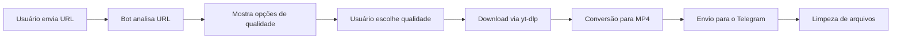

#  Telegram Video Downloader Bot
```markdown
# 🤖 Telegram Video Downloader Bot

Um bot do Telegram poderoso para download de vídeos do YouTube, Instagram, Facebook, TikTok, Twitter/X e outras plataformas.

## ✨ Funcionalidades

- 📥 **Download de vídeos** de múltiplas plataformas
- 🎬 **Qualidade selecionável** (melhor, 720p, MP4, menor)
- 📊 **Progresso em tempo real** com status atualizado
- 🗑️ **Limpeza automática** de arquivos temporários (24h)
- 🔄 **Cache inteligente** para evitar downloads duplicados
- 🎛️ **Interface interativa** com botões inline
- 📱 **Suporte a múltiplos usuários** simultaneamente
- 🔒 **Limite de 2GB** (respeitando limite do Telegram)
- 🧹 **Comando de limpeza** para administradores

## 🚀 Plataformas Suportadas

| Plataforma | Vídeos | Lives | Reels/Shorts |
|------------|--------|-------|--------------|
| YouTube | ✅ | ❌ | ✅ |
| Instagram | ✅ | ❌ | ✅ |
| Facebook | ✅ | ❌ | ✅ |
| TikTok | ✅ | ❌ | ✅ |
| Twitter/X | ✅ | ❌ | ✅ |
| Outros sites | ✅* | ❌ | ❌ |

*\* Sites suportados pelo yt-dlp*

## 📋 Pré-requisitos

- Python 3.8 ou superior
- pip (gerenciador de pacotes)
- Token de Bot do Telegram ([@BotFather](https://t.me/BotFather))
- FFmpeg (para conversão de vídeos)
```
## 🔧 Instalação

### 1. Clone o repositório
```bash
git clone https://github.com/seu-usuario/telegram-video-downloader.git
cd telegram-video-downloader
```

### 2. Crie um ambiente virtual (recomendado)
```bash
python -m venv venv
source venv/bin/activate  # Linux/Mac
# ou
venv\Scripts\activate  # Windows
```

### 3. Instale as dependências
```bash
pip install python-telegram-bot yt-dlp
```

### 4. Instale o FFmpeg

**Ubuntu/Debian:**
```bash
sudo apt update
sudo apt install ffmpeg
```

**MacOS:**
```bash
brew install ffmpeg
```

**Windows:**
- Baixe do [site oficial do FFmpeg](https://ffmpeg.org/download.html)
- Adicione ao PATH do sistema

### 5. Configure o token do bot

**Opção 1: Variável de ambiente**
```bash
export TELEGRAM_BOT_TOKEN='seu_token_aqui'
```

**Opção 2: Arquivo .env** (recomendado)
```bash
echo "TELEGRAM_BOT_TOKEN=seu_token_aqui" > .env
```

### 6. Configure cookies (opcional, mas recomendado)
- Coloque o arquivo `all_cookies.txt` na pasta `app/`
- Ajuda a acessar conteúdo restrito ou com verificação de idade

## 🎮 Comandos do Bot

| Comando | Descrição |
|---------|-----------|
| `/start` | Iniciar o bot e ver mensagem de boas-vindas |
| `/help` | Mostrar instruções detalhadas |
| `/download` | Iniciar download de um vídeo |
| `/status` | Ver progresso do download atual |
| `/cancel` | Cancelar download em andamento |
| `/formats` | Ver formatos e qualidades disponíveis |
| `/clean` | Limpar arquivos temporários (admin) |

## 📱 Como Usar

### Método 1: Enviar URL diretamente
1. Envie qualquer URL de vídeo para o bot
2. Escolha a qualidade desejada nos botões
3. Aguarde o download e conversão
4. Receba o vídeo automaticamente

### Método 2: Usar comandos
1. Digite `/download`
2. Envie a URL quando solicitado
3. Escolha a qualidade
4. Aguarde o processamento

### Exemplo de URLs suportadas
```
YouTube: https://youtu.be/dQw4w9WgXcQ
Instagram: https://www.instagram.com/reel/Cxample/
TikTok: https://www.tiktok.com/@user/video/123456789
Facebook: https://www.facebook.com/watch/?v=123456789
Twitter: https://twitter.com/user/status/123456789
```

## 📁 Estrutura do Projeto

```
telegram-video-downloader/
├── app/
│   ├── bot.py                    # Código principal do bot
│   ├── all_cookies.txt           # Cookies combinados
│   └── www.facebook.com_cookies.txt  # Cookies específicos
├── uploads/                      # Pasta temporária (criada automaticamente)
├── requirements.txt              # Dependências
├── .env                         # Variáveis de ambiente (token)
└── README.md                    # Documentação
```

## 🎚️ Qualidades Disponíveis

| Qualidade | Descrição | Uso Recomendado |
|-----------|-----------|-----------------|
| **Melhor** | Melhor qualidade disponível | Vídeos em geral |
| **720p** | Alta definição | Equilíbrio qualidade/tamanho |
| **MP4** | Formato universal | Compatibilidade máxima |
| **Menor** | Menor tamanho | Economia de dados |

## 🔄 Fluxo de Funcionamento



## ⚙️ Configurações Avançadas

### Modificar limite de arquivo
```python
# Em bot.py
self.MAX_FILE_SIZE = 1500 * 1024 * 1024  # 1.5GB
```

### Alterar intervalo de limpeza
```python
# Em bot.py
self.CLEANUP_INTERVAL = 43200  # 12 horas
```

### Adicionar administradores
```python
# Em bot.py
self.ADMIN_IDS = [123456789, 987654321]  # IDs do Telegram
```

### Configurar proxy (opcional)
```python
# Em download_video() - adicionar nas opções
'proxy': 'http://proxy:8080',
```

## 🐛 Solução de Problemas

### Erro: "FFmpeg não encontrado"
```bash
# Verificar instalação
ffmpeg -version

# Reinstalar se necessário
sudo apt install --reinstall ffmpeg  # Linux
brew reinstall ffmpeg                 # Mac
```

### Erro: "Vídeo privado"
- O vídeo pode ser privado ou exigir login
- Configure cookies.txt com sua sessão logada

### Erro: "Timeout" ou "Network Error"
- Verifique sua conexão com a internet
- Aumente os timeouts no código:
```python
.read_timeout(120)
.write_timeout(120)
```

### Bot não responde
- Verifique se o token está correto
- Reinicie o bot
- Verifique logs para erros específicos

### Download muito lento
- Use uma conexão estável
- Considere usar proxy
- Teste com qualidades menores

## 🔒 Segurança e Privacidade

- ✅ **Arquivos temporários**: Removidos automaticamente após 24h
- ✅ **Cache simples**: Apenas em memória, sem banco de dados
- ✅ **Cookies opcionais**: Use apenas se necessário
- ✅ **Sem logs persistentes**: Apenas logs de execução
- ✅ **Limite de tamanho**: Evita abuso do sistema

## 📊 Performance

- **Concorrência**: Suporta múltiplos usuários simultâneos
- **Cache**: Evita downloads duplicados da mesma URL
- **Limpeza**: Automática para evitar acúmulo de arquivos
- **Timeouts**: Configurados para downloads longos

## 🛠️ Roadmap

- [ ] Suporte a playlists
- [ ] Download de áudio (MP3)
- [ ] Legendas automáticas
- [ ] Estatísticas de uso
- [ ] Download de shorts/reels específicos
- [ ] Interface com mais opções de qualidade
- [ ] Suporte a lives (via Streamlink)
- [ ] Envio em partes para arquivos grandes

## 🤝 Contribuindo

Contribuições são bem-vindas!

1. Faça um Fork do projeto
2. Crie sua Feature Branch (`git checkout -b feature/AmazingFeature`)
3. Commit suas mudanças (`git commit -m 'Add some AmazingFeature'`)
4. Push para a Branch (`git push origin feature/AmazingFeature`)
5. Abra um Pull Request

### Padrões de código
- Use type hints para funções
- Documente métodos complexos
- Teste com diferentes plataformas
- Mantenha logs informativos

## ⚠️ Aviso Legal

**IMPORTANTE:** Este bot é fornecido apenas para fins educacionais. O download de conteúdo protegido por direitos autorais pode violar leis em sua jurisdição.

- 🚫 Não hospedamos ou distribuímos conteúdo ilegal
- 🚫 O usuário é o único responsável pelo uso do bot
- 🚫 Respeite os direitos autorais e termos de serviço das plataformas
- 🚫 Não use para download massivo ou automatizado

## 📞 Suporte e Contato

- 📧 Email: devdavid1998@gmail.com
- 💬 Telegram: [@david_cardoso01](https://t.me/david_cardoso01)

## 🙏 Agradecimentos

- [python-telegram-bot](https://github.com/python-telegram-bot/python-telegram-bot) - Framework PTB
- [yt-dlp](https://github.com/yt-dlp/yt-dlp) - Downloader de vídeos
- [FFmpeg](https://ffmpeg.org/) - Processamento de vídeo
- [@BotFather](https://t.me/BotFather) - Criação do bot

## 🚀 Deploy Rápido (Docker)

```dockerfile
FROM python:3.9-slim

WORKDIR /app

RUN apt-get update && apt-get install -y ffmpeg

COPY requirements.txt .
RUN pip install -r requirements.txt

COPY app/ ./app/

ENV TELEGRAM_BOT_TOKEN="seu_token"

CMD ["python", "app/bot.py"]
```


## 🔧 Arquivo requirements.txt

```txt
python-telegram-bot==20.7
yt-dlp==2024.12.23
```

---

**Feito com 🤖 e ❤️ para a comunidade do Telegram**

*Última atualização: Janeiro 2026*
```


### 2. **Arquivo .env.example**:
```env
TELEGRAM_BOT_TOKEN=seu_token_aqui
```
